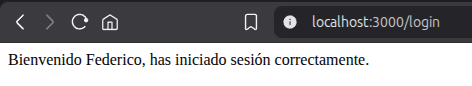
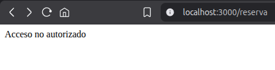
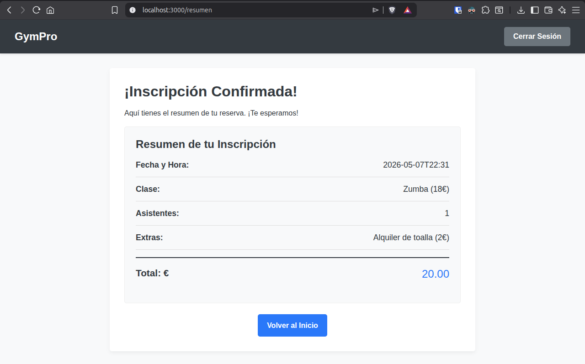
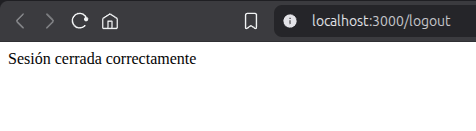

# UD2_AC10 – Sesiones y mantenimiento de estado

**Nombre:** Federico Luque

## Especificaciones Técnicas

- **Versión de Node.js:** v24.15.0
- **Versión de Express:** 5.2.1
- **Versión de express-session:** 1.19.0

---

## Cómo funciona el mecanismo de sesiones implementado

Se ha incorporado express-session, un middleware que asigna a cada navegador un identificador de sesión único almacenado en una cookie. En el servidor, ese identificador queda vinculado a un objeto req.session donde se puede guardar información persistente entre peticiones, como si el usuario está autenticado o no.

El middleware se registra antes de las rutas con:

app.use(session({
    secret: 'mi_clave_secreta',
    resave: false,
    saveUninitialized: false
}));

- secret: clave usada para firmar la cookie de sesión y garantizar su integridad.
- resave: false: evita guardar la sesión de nuevo si no ha sido modificada.
- saveUninitialized: false: no crea sesiones vacías para usuarios que aún no se han autenticado.

---

## Qué información se guarda en req.session y por qué

Cuando el usuario envía el formulario de login con credenciales correctas, el servidor ejecuta:

req.session.autenticado = true;
req.session.usuario = email;

- **autenticado**: marca booleana que indica que ese usuario ha superado la validación de credenciales. Es la propiedad que consulta el middleware de acceso para decidir si permite o bloquea la petición.
- **usuario**: almacena el email del usuario identificado, lo que permite saber quién está detrás de cada petición sin volver a pedir credenciales.

Esta información queda almacenada en el servidor asociada al identificador de sesión. En peticiones posteriores, express-session recupera automáticamente el objeto req.session correcto a partir de la cookie del navegador.

---

## Cómo se protege la ruta /reserva

En lugar de poner la comprobación de autenticación directamente dentro de cada ruta, se ha creado un middleware propio en src/middlewares/authMiddleware.js:

export function requiereAutenticacion(req, res, next) {
    if (!req.session.autenticado) {
        return res.status(401).send('Acceso no autorizado');
    }
    next();
}

Este middleware se aplica a la ruta /reserva tanto para el acceso a la página como para el envío del formulario:

app.get('/reserva', requiereAutenticacion, (req, res) => { ... });
app.post('/reserva', requiereAutenticacion, (req, res) => { ... });

Cuando llega una petición a /reserva:
1. Express ejecuta primero requiereAutenticacion.
2. Si req.session.autenticado no existe o es falso, responde con 401 y corta el flujo.
3. Si es verdadero, llama a next() y la petición llega al handler de la ruta.

---

## Qué ocurre técnicamente al ejecutar /logout

La ruta GET /logout ejecuta req.session.destroy():

app.get('/logout', (req, res) => {
    req.session.destroy((error) => {
        if (error) {
            return res.status(500).send('Error al cerrar la sesión');
        }
        res.send('Sesión cerrada correctamente');
    });
});

Al destruir la sesión:
- Se elimina del servidor toda la información asociada a ese identificador de sesión (autenticado, usuario, etc.).
- El identificador de sesión deja de estar vinculado a un estado válido.
- La cookie puede seguir existiendo temporalmente en el navegador, pero en la siguiente petición el servidor no encontrará ningún estado autenticado asociado a ella.
- Por tanto, el middleware requiereAutenticacion bloqueará cualquier intento de acceder a rutas protegidas.

---

## Capturas de Pantalla

### 1. Login correcto

---

### 2. Intento de acceso a `/reserva` sin login

---

### 3. Reserva realizada tras login

---

### 4. Ejecución de `/logout`

---

## Diferencia entre validación puntual de formulario y autenticación basada en sesión

Anteriormente el servidor comprobaba las credenciales cada vez que llegaba una petición, pero no guardaba ningún registro de quién había iniciado sesión. Cada petición era independiente y el servidor no tenía forma de saber si el usuario ya se había identificado antes. Esto significa que no había ningún control de acceso, cualquiera podía intentar acceder a cualquier ruta sin haber pasado por el login.

Ahora las credenciales solo se comprueban una vez, en el momento del login. Si son correctas, el servidor guarda en la sesión que ese usuario está autenticado. A partir de ahí, en cada petición posterior no hace falta volver a pedir usuario y contraseña, si no consultar el estado almacenado en req.session para saber si el usuario tiene acceso o no.

Antes el servidor olvidaba al usuario en cuanto terminaba la petición, ahora lo recuerda mientras la sesión esté activa. Eso es lo que permite proteger rutas de verdad, porque el middleware puede comprobar ese estado antes de dejar pasar la petición.

---

## Por qué se ha creado un middleware propio para el control de acceso

Poner la comprobación if (!req.session.autenticado) directamente dentro de cada ruta protegida funcionaría, pero habría que repetir la misma comprobación en cada ruta. Y si cambia la lógica de autenticación, habría que modificar todas las rutas.

Con un middleware independiente, la comprobación se centraliza en un único lugar, se puede aplicar a cualquier ruta con una sola palabra y se mantiene la separación de responsabilidades.

