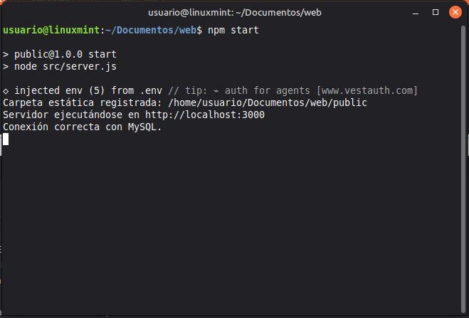
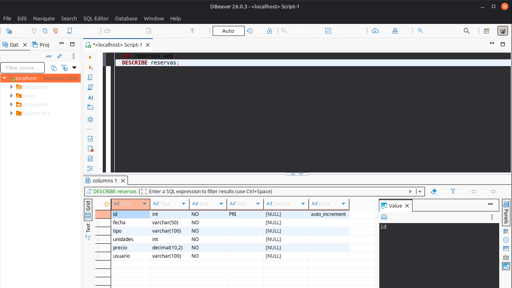
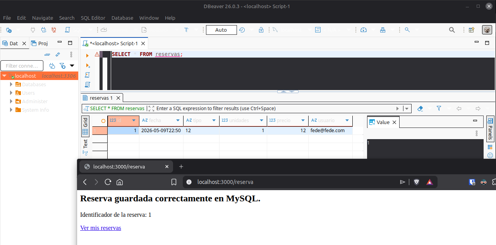
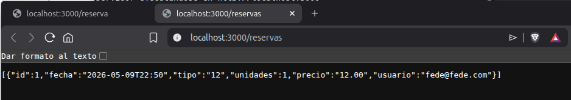
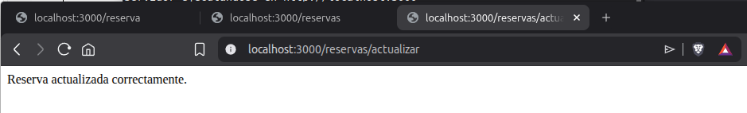
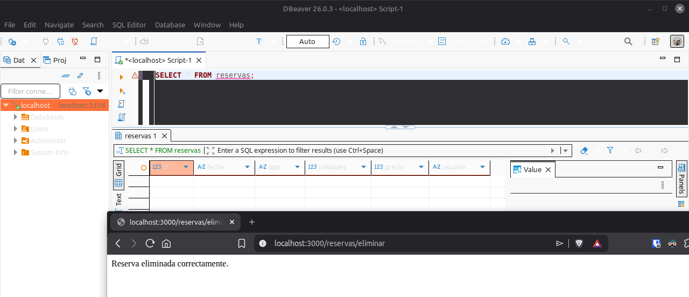
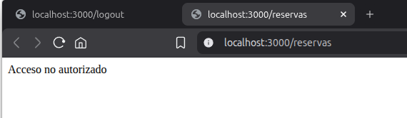
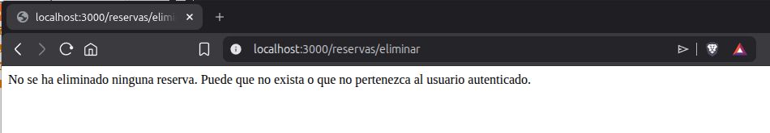

# UD3_AC11 – Persistencia avanzada con MySQL

**Nombre:** Federico Luque

## Especificaciones Técnicas

- **Versión de Node.js:** v24.15.0
- **Versión de Express:** 5.2.1
- **Versión de MySQL:** 8.0.45

---

## Del JSON a MySQL: por qué cambiar el sistema de persistencia

En las prácticas anteriores las reservas se guardaban en un archivo `reservas.json`. Ese enfoque funcionaba porque era sencillo y no requería ninguna instalación adicional, pero tiene limitaciones importantes: no soporta consultas, no garantiza integridad de los datos y no es escalable.

Con MySQL el almacenamiento pasa a ser una base de datos relacional. Cada reserva ocupa una fila en una tabla, los campos tienen tipos definidos, el identificador se genera automáticamente y se puede consultar o filtrar directamente en la base de datos sin tocar el código de Node. Además, asociar cada reserva al usuario que la creó es tan sencillo como añadir una columna `usuario` con un índice o una restricción.

El cambio no altera la arquitectura del proyecto, lo único que cambia es que ese servicio ya no lee ni escribe un archivo, sino que ejecuta consultas SQL sobre la base de datos.

---

## Base de datos y tabla `reservas`

La base de datos se llama `reservas_web` y contiene una única tabla principal llamada `reservas`. Cada fila de esa tabla representa una reserva concreta realizada por un usuario autenticado.

La tabla se creó con la siguiente sentencia SQL:

CREATE TABLE IF NOT EXISTS reservas (
  id       INT AUTO_INCREMENT PRIMARY KEY,
  fecha    VARCHAR(50)     NOT NULL,
  tipo     VARCHAR(100)    NOT NULL,
  unidades INT             NOT NULL,
  precio   DECIMAL(10,2)   NOT NULL,
  usuario  VARCHAR(100)    NOT NULL
);

Explicación de cada campo:

- **id**: identificador único de cada reserva, generado automáticamente por MySQL con `AUTO_INCREMENT`.
- **fecha**: fecha y hora de la clase reservada.
- **tipo**: precio por unidad de la clase seleccionada.
- **unidades**: número de asistentes incluidos en la reserva.
- **precio**: precio total calculado como `tipo × unidades`.
- **usuario**: email del usuario autenticado que realizó la reserva, obtenido de la sesión.

---

## Cómo se conecta Node.js con MySQL

La conexión se gestiona desde el archivo `src/config/db.js`, que mantiene el código de base de datos separado del resto del servidor.

- **`mysql2`**: librería de Node.js que permite ejecutar consultas SQL contra una base de datos MySQL.
- **`dotenv`**: librería que carga las variables definidas en el archivo `.env` dentro de `process.env`, evitando escribir contraseñas o datos sensibles directamente en el código.
- **`.env`**: archivo en la raíz del proyecto con los parámetros de conexión. Este archivo no se sube al repositorio porque está incluido en `.gitignore`.
- **`db.js`**: crea un pool de conexiones con `mysql.createPool()` y exporta tanto el pool como la función `comprobarConexion()`, que verifica al arrancar el servidor que la conexión con MySQL es correcta.

---

## Cambios en `reservasService.js`

El servicio deja de usar `fs`, `readFileSync`, `writeFile` y el archivo `reservas.json`. Ahora importa el pool de conexiones desde `../config/db.js` y expone cuatro funciones asíncronas:

- **`guardarReserva(reserva)`**: inserta una nueva fila en la tabla `reservas` con los datos del objeto `Reserva`. Devuelve el `insertId` generado por MySQL, que es el identificador único de la nueva reserva.
- **`obtenerReservasPorUsuario(usuario)`**: ejecuta un `SELECT` filtrando por el campo `usuario`, de forma que cada usuario solo puede consultar sus propias reservas. Devuelve un array de filas ordenadas de más reciente a más antigua.
- **`actualizarReserva(id, reserva, usuario)`**: ejecuta un `UPDATE` con la condición `WHERE id = ? AND usuario = ?`. Al exigir también el `usuario`, se impide que un usuario modifique reservas que no le pertenecen. Devuelve `affectedRows`.
- **`eliminarReserva(id, usuario)`**: ejecuta un `DELETE` con la misma condición doble `id AND usuario`, por la misma razón de seguridad. Devuelve `affectedRows`.

Todas las funciones usan parámetros con `?` en lugar de concatenar valores directamente en la cadena SQL. Esto evita inyección SQL, ya que MySQL trata esos valores como datos y no como parte de la instrucción.

---

## Cambios en `server.js`

Se han actualizado las importaciones para incluir `comprobarConexion` y las nuevas funciones del servicio. La llamada a `comprobarConexion()` se realiza justo después de crear la aplicación Express, de modo que al arrancar el servidor aparece en la terminal si la conexión con MySQL es correcta o si hay algún error.

Las rutas relacionadas con reservas ahora son `async` y usan `await` para esperar las operaciones de MySQL. Los errores se capturan con `try catch`.

- **`POST /reserva`**: recibe los datos del formulario, obtiene el usuario desde `req.session.usuario`, calcula el precio total y llama a `guardarReserva()`. Devuelve el identificador generado y un enlace a `/reservas`.
- **`GET /reservas`**: protegida con `requiereAutenticacion`, consulta las reservas del usuario autenticado mediante `obtenerReservasPorUsuario()` y las devuelve en formato JSON.
- **`POST /reservas/actualizar`**: protegida con `requiereAutenticacion`, recibe el `id` y los nuevos datos, llama a `actualizarReserva()`. Si `affectedRows` es 0, responde con 404 indicando que la reserva no existe o no pertenece al usuario.
- **`POST /reservas/eliminar`**: protegida con `requiereAutenticacion`, recibe el `id`, llama a `eliminarReserva()`. Si `affectedRows` es 0, responde con 404 con el mismo criterio.

---

## Cómo se asocian las reservas al usuario autenticado mediante `req.session.usuario`

Cuando el usuario inicia sesión correctamente, el servidor guarda su email en `req.session.usuario`. A partir de ese momento, ese valor está disponible en todas las peticiones que realice mientras la sesión esté activa.

Al crear una reserva, la ruta `POST /reserva` lee ese valor y lo pasa al constructor de `Reserva` como quinto parámetro:

const usuario = req.session.usuario;
const nuevaReserva = new Reserva(fechaClase, tipoClase, asistentes, precio, usuario);

La función `guardarReserva()` del servicio lo incluye en la consulta SQL de inserción:

INSERT INTO reservas (fecha, tipo, unidades, precio, usuario) VALUES (?, ?, ?, ?, ?)

De esta forma, cada fila de la tabla `reservas` queda vinculada al email del usuario que la creó. Las consultas posteriores filtran siempre por ese campo, de modo que cada usuario solo puede ver y gestionar sus propias reservas.

---

## Por qué el usuario se obtiene de la sesión y no del formulario

El usuario autenticado siempre se lee desde `req.session.usuario`, nunca desde un campo del formulario. Un campo de formulario puede ser manipulado por cualquier persona desde el navegador: basta con abrir las herramientas de desarrollo y modificar el valor antes de enviarlo.

La sesión, en cambio, está almacenada en el servidor. El navegador solo guarda la cookie con el identificador de sesión, pero no puede modificar el contenido de `req.session`. Por eso el backend puede confiar en `req.session.usuario` para saber quién está haciendo la petición, independientemente de lo que venga en el cuerpo del formulario.

---

## Cómo se evita que un usuario actualice o elimine reservas ajenas

Las rutas de actualización y eliminación añaden la condición `AND usuario = ?` a sus consultas SQL:

UPDATE reservas SET ... WHERE id = ? AND usuario = ?
DELETE FROM reservas WHERE id = ? AND usuario = ?

Si alguien envía el `id` de una reserva que pertenece a otro usuario, MySQL no encontrará ninguna fila que cumpla ambas condiciones y devolverá `affectedRows = 0`. En ese caso el servidor responde con un 404 indicando que la operación no se ha completado. La reserva original queda intacta en la base de datos.

---

## Capturas de Pantalla

### 1. Conexión correcta con MySQL en la terminal

---

### 2. Estructura de la tabla `reservas`

---

### 3. Inserción correcta de una reserva

---

### 4. Consulta de reservas desde `/reservas`

---

### 5. Actualización correcta de una reserva

---

### 6. Eliminación correcta de una reserva

---

### 7. Bloqueo de una operación sin sesión activa

---

### 8. Intento de actualizar o eliminar una reserva ajena

