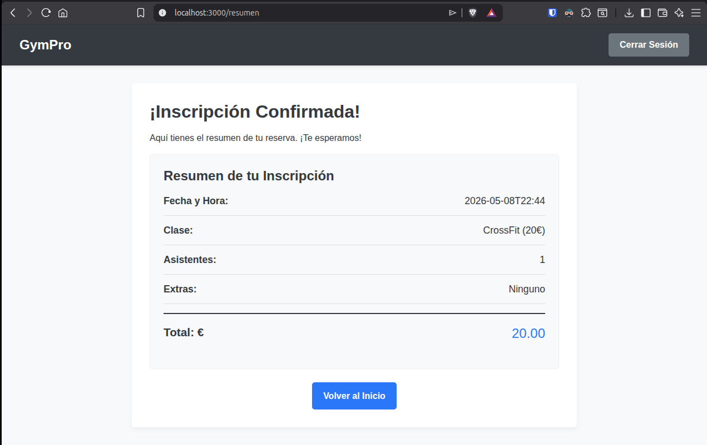
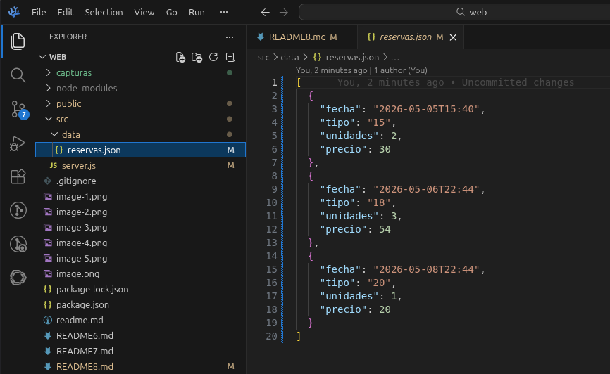
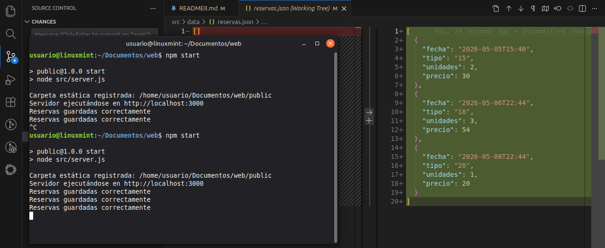

# UD2_AC8 – Persistencia con JSON

**Nombre:** Federico Luque

## Especificaciones Técnicas

- **Versión de Node.js:** v24.15.0
- **Versión de Express:** 5.2.1

---

## ¿Qué hace el servidor cuando recibe una reserva?

Cuando el usuario rellena el formulario de reserva y pulsa "Confirmar Inscripción", se desencadena el siguiente flujo:

1. **El navegador envía una petición HTTP POST** a la ruta /resumen con los datos del formulario codificados en el cuerpo de la petición.

2. **Express parsea los datos** gracias al middleware express.urlencoded, dejándolos accesibles en req.body como un objeto JavaScript con las propiedades fechaClase, tipoClase y asistentes.

3. **El servidor valida los datos recibidos:**
   - Comprueba que los tres campos obligatorios existen y no están vacíos.
   - Verifica que el número de asistentes sea mayor que cero.
   - Verifica que se ha seleccionado un tipo de clase válido (distinto de 0).
   - Si alguna validación falla, responde con un mensaje de error y detiene el flujo.

4. **Se construye el objeto de la nueva reserva** con los datos reales del formulario:

   const nuevaReserva = {
       fecha: fechaClase,
       tipo: tipoClase,
       unidades: Number(asistentes),
       precio: Number(tipoClase) * Number(asistentes)
   };
 

5. **La reserva se añade al array en memoria** con reservas.push(nuevaReserva). Este array fue cargado al inicio del servidor leyendo src/data/reservas.json con fs.readFileSync y parseado con JSON.parse.

6. **El array actualizado se convierte a texto JSON** con JSON.stringify(reservas, null, 2) para poder escribirlo en el archivo.

7. **Se escribe el archivo de forma asíncrona** usando fs.writeFile. Cuando la escritura termina, se ejecuta el callback:
   - Si ocurrió un error, se registra en consola y se responde con un mensaje de error.
   - Si todo fue bien, se imprime 'Reservas guardadas correctamente' en consola y el servidor envía el archivo resumen.html al navegador.

8. **El dato queda persistido en disco.** Si el servidor se reinicia, el archivo reservas.json ya contiene todas las reservas anteriores, que son leídas de nuevo al arrancar.

---

## Capturas de Pantalla

### 1. Envío correcto de una reserva desde el formulario

---

### 2. Contenido del archivo reservas.json tras guardar varias reservas

---

### 3. Mensaje de confirmación en la consola del servidor

---

## ¿Qué he aprendido en esta práctica?

En esta actividad he aprendido a implementar persistencia de datos en el servidor sin usar una base de datos, usando un archivo de texto en formato JSON como soporte de almacenamiento. Los conceptos clave que he trabajado son:

- Lectura síncrona de archivos con fs.readFileSync: permite cargar el estado del sistema al arrancar el servidor, garantizando que las reservas previas estén disponibles desde el primer momento.
- Conversión entre texto y estructuras de JavaScript con JSON.parse y JSON.stringify: el archivo solo almacena texto, por lo que es necesario convertir los datos al formato adecuado en cada sentido.

