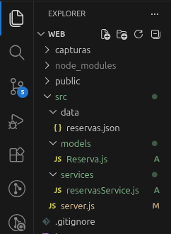
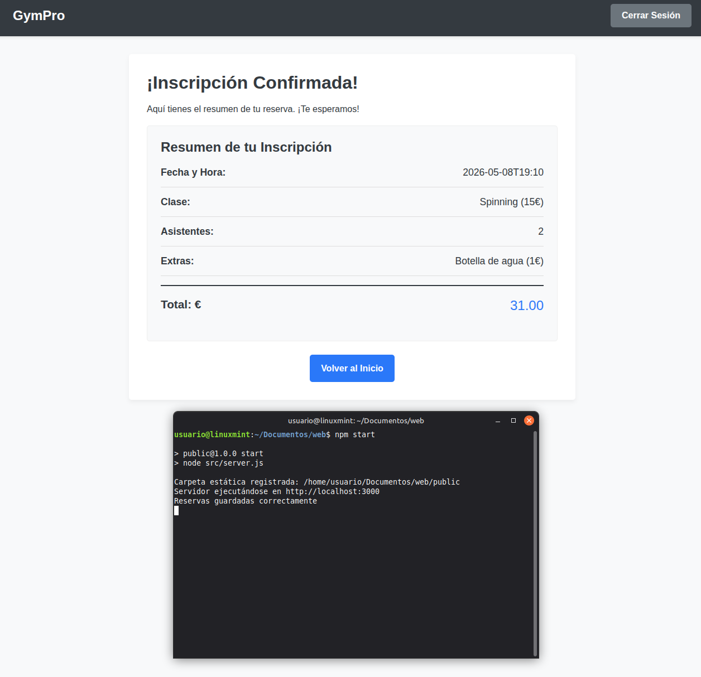
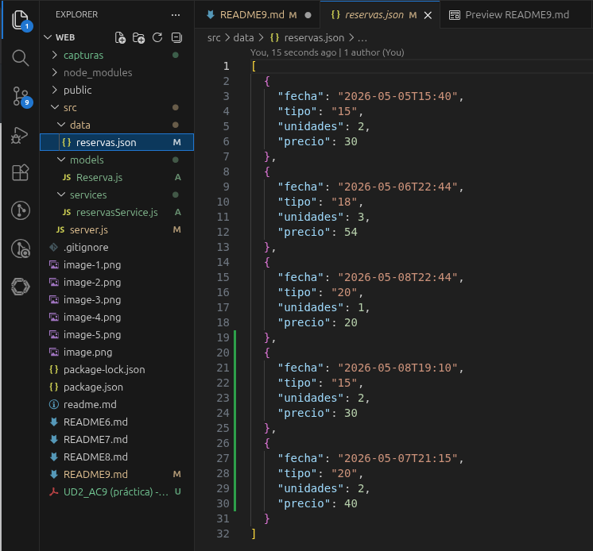

# UD2_AC9 – Organización backend y uso de clases

**Nombre:** Federico Luque

## Especificaciones Técnicas

- **Versión de Node.js:** v24.15.0
- **Versión de Express:** 5.2.1

---

## Organización del proyecto al final de la AC8

Al terminar la AC8, todo el código del backend estaba concentrado en un único archivo, server.js. Ese archivo era responsable de:

- Importar y usar el módulo fs directamente
- Leer el archivo reservas.json al arrancar con fs.readFileSync
- Parsear el contenido con JSON.parse
- Construir el objeto de la reserva con datos literales del req.body
- Añadir la reserva al array en memoria
- Convertir el array a texto con JSON.stringify
- Escribir el archivo con fs.writeFile y gestionar el callback
- Gestionar todas las rutas HTTP (/login, /reserva, /resumen, etc.)

---

## Organización del proyecto tras la AC9

En la AC9 el backend se ha reorganizado en tres módulos con responsabilidades claramente separadas:

/src
  server.js
  /models
    Reserva.js
  /services
    reservasService.js
  /data
    reservas.json

### Responsabilidad de cada archivo

#### server.js
Es el punto de entrada de la aplicación. Se encarga únicamente de:
- Configurar Express y registrar middlewares
- Definir las rutas (/login, /reserva, /resumen, etc.)
- Orquestar el flujo: recibe los datos, delega en los módulos y envía la respuesta

#### models/Reserva.js
Representa la entidad principal del sistema. Contiene la clase Reserva con su constructor, que recibe fecha, tipo, unidades y precio y los asigna como propiedades del objeto.

#### services/reservasService.js
Es el módulo de acceso a datos. Contiene toda la lógica relacionada con el sistema de archivos:
- leerReservas() — lee reservas.json con fs.readFileSync y devuelve el array parseado con JSON.parse
- guardarReservas(reservas, callback) — convierte el array a texto con JSON.stringify y lo escribe en disco con fs.writeFile, gestionando el callback.

#### data/reservas.json
Almacenamiento persistente del sistema. Contiene únicamente un array JSON con los objetos de reserva guardados.

---

## Flujo completo cuando se recibe una reserva

1. El usuario rellena el formulario y lo envía → el navegador hace un POST a /resumen
2. server.js recibe los datos a través de req.body
3. server.js valida que los campos obligatorios existen y son correctos
4. server.js crea una nueva instancia de la clase Reserva (definida en models/Reserva.js) con los datos del formulario
5. server.js llama a leerReservas() del servicio → reservasService.js lee reservas.json y devuelve el array actualizado
6. server.js añade la nueva instancia al array con push
7. server.js llama a guardarReservas(reservas, callback) → reservasService.js convierte el array a texto y escribe el archivo en disco
8. Cuando la escritura termina, el callback informa del resultado: si fue bien, server.js envía resumen.html al navegador; si falló, responde con un mensaje de error

---

## Capturas de Pantalla

### 1. Estructura final de carpetas del proyecto

---

### 2. Funcionamiento correcto tras la reorganización

---

### 3. Contenido actualizado de reservas.json

---

## Ventajas de esta organización respecto a la AC8

- **Separación de responsabilidades:** cada archivo tiene un único propósito claro. Si hay un bug en la lectura del JSON, se busca en reservasService.js; si hay un problema de rutas, se busca en server.js.
- **Legibilidad:** server.js es ahora mucho más corto y fácil de leer. El flujo de cada ruta se entiende de un vistazo.
- **Reutilización:** leerReservas() y guardarReservas() se pueden llamar desde cualquier ruta sin repetir código.

